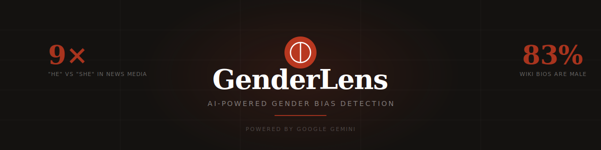

<div align="center">



<br/>

[](GenderLens.html)
[](https://aistudio.google.com)
[](GenderLens.html)
[](LICENSE)
[](https://aistudio.google.com/apikey)

<br/>

**GenderLens** is a single-file web app that analyses any text or URL for gender bias — across pronouns, gendered language, anthropomorphism, and domain stereotyping — using Google Gemini AI.

*Drop in an article. Get a bias score, annotated text, flagged phrases, and rewrite suggestions in seconds.*

<br/>

</div>

---

## ✨ Features

- 🔍 **Four-layer analysis** — pronouns, gendered language, anthropomorphism, domain stereotyping
- 📊 **Calibrated 0–100 bias score** with severity tiers (Low / Moderate / High / Severe)
- 🎨 **Colour-coded annotations** — highlights bias directly in the original text
- 💡 **Rewrite suggestions** — neutral alternatives for every flagged phrase
- 📈 **Pronoun ratio bar** — visual breakdown of he/she/they distribution
- 🌐 **URL scraping** — paste a link, not just text
- 🕑 **Scan history** — last 5 analyses saved in browser
- 📋 **Copy report** — one-click plain-text export
- 🚀 **Zero install** — one HTML file, open in any browser
- 💸 **Free** — uses Google Gemini free tier

---

## 🚀 Quick Start

**Two steps:**

```bash
# 1. Clone the repo
git clone https://github.com/YOUR_USERNAME/genderlens.git
cd genderlens

# 2. Serve it locally (required for API calls — see why below)
python3 -m http.server 8080
```

Then open **[http://localhost:8080/GenderLens.html](http://localhost:8080/GenderLens.html)** in Chrome.

> **Why a local server?** Chrome blocks API calls from `file://` pages due to CORS policy. A local server gives the page a real `localhost` origin and bypasses this in one step. Python comes pre-installed on Mac — no install needed.

<details>
<summary><strong>💡 Get your free API key (takes 60 seconds)</strong></summary>

<br/>

1. Go to [aistudio.google.com/apikey](https://aistudio.google.com/apikey)
2. Sign in with any Google account
3. Click **Create API Key**
4. Open `GenderLens.html` in a text editor
5. Find `YOUR_API_KEY_HERE` near the top and replace it with your key
6. Save and refresh

The free tier supports ~15 requests/minute — more than enough for personal use.

</details>

<details>
<summary><strong>🪟 Windows quick start</strong></summary>

<br/>

```cmd
# If Python is installed:
python -m http.server 8080

# If not, install Python from python.org — it's free and takes 2 minutes
# Then run the command above and open http://localhost:8080/GenderLens.html
```

Alternatively, open the file in [VS Code](https://code.visualstudio.com/) and use the **Live Server** extension.

</details>

---

## 🔬 How It Works

GenderLens runs four parallel analyses on every piece of text:

| Layer | What it detects | Example |
|---|---|---|
| 🔤 **Pronoun analysis** | Asymmetric he/she/they ratios; pronouns applied to non-human entities | *"The AI learned from his mistakes"* |
| 🏷 **Gendered language** | Role nouns, power-coded adjectives, occupational stereotyping | *"The chairman opened proceedings"* |
| 🤖 **Anthropomorphism** | Ships, AI, robots, countries given a gender without reason | *"She set sail on her maiden voyage"* |
| 🌐 **Domain stereotyping** | STEM/leadership defaulting to male; caregiving defaulting to female | *"Nurses should remind their patients"* |

These results feed into a single calibrated score, a set of annotated highlights, and specific rewrite suggestions.

---

## 📊 Scoring Rubric

Scores are calibrated against real-world examples — most content lands between 15 and 65:

| Score | Tier | What it means | Real-world example |
|---|---|---|---|
| **0–10** | 🟢 Low | Genuinely neutral. Very rare. | Scientific paper using "they" throughout |
| **11–25** | 🟢 Low | One or two minor isolated issues | General news piece with slight male source skew |
| **26–50** | 🟡 Moderate | Noticeable pattern, fixable with light editing | Tech blog using "he" for developers a few times |
| **51–75** | 🟠 High | Systematic and pervasive across the text | Job listing with "he will be responsible for…" throughout |
| **76–100** | 🔴 Severe | Egregious — multiple categories compounding | Text with gendered role nouns + anthropomorphism + domain stereotyping simultaneously |

> The score is context-aware. A historical article about a male figure using "he" throughout scores low — that's appropriate. A tech article using "he" for a generic unnamed engineer scores higher — that's an assumption.

---

## 🏛 The Research Behind It

<details>
<summary><strong>📰 Media & news bias</strong></summary>

<br/>

- **"He" pronouns appear 9× more than "she"** in news media — even when the subject's gender is unknown or unspecified. This holds across both broadsheet and tabloid coverage. *(Gustafsson Sendén et al., Sex Roles, 2015)*

- **Men are quoted 3× more often than women** in mainstream English-language news, across politics, business, and sport. This was measured across 7 Canadian outlets over two years using NLP. *(Gender Gap Tracker, PLOS ONE, 2021)*

- A decade of TV broadcast data (CNN, MSNBC, Fox News, BBC) found **all four channels heavily biased toward male pronouns**, though the gap has slowly narrowed since 2019. *(GDELT Project)*

</details>

<details>
<summary><strong>📚 Wikipedia gender gap</strong></summary>

<br/>

- **83% of Wikipedia biographies are about men.** Women account for only 17% of published biographies. *(Wikipedia gender bias research, 2021)*

- **90% of Wikipedia editors identify as male**, which directly shapes coverage priorities and framing. *(Wikimedia Foundation survey, 2018)*

- Female Wikipedia articles are significantly more likely to be nominated for deletion than equivalent male articles. In 2021, 41% of biographies nominated for deletion were women, despite women being only 17% of published biographies.

- Women's articles are more likely to mention family relationships and personal life; men's articles focus on professional achievements.

</details>

<details>
<summary><strong>🤖 AI & language model bias</strong></summary>

<br/>

- LLMs express **occupational gender bias aligned with human stereotypes** — and in some cases amplify them beyond real-world statistics. When asked to complete sentences about professions, models assign male pronouns to stereotypically male occupations and female pronouns to stereotypically female ones at higher rates than actual workforce demographics. *(Kotek, Dockum & Sun, ACM Collective Intelligence, 2023)*

- Research measuring gender bias in machine translation found that **commercial tools frequently reinforce gender stereotypes by incorrectly assigning genders to professions** rather than following linguistic accuracy. *(Prates et al., 2020)*

- Female characters with speaking roles in film reached **37% in 2024** — up from 35% the previous year, and the first year in which male and female protagonists reached parity (42% each). Progress is real but slow. *(San Diego State University, 2024)*

</details>

<details>
<summary><strong>💼 Workplace & language</strong></summary>

<br/>

- Only **14% of news organisations** set gender-based numeric targets for representation, compared to 35% of companies in corporate America overall. *(McKinsey & Company)*

- Studies show masculine leadership titles like **"chairman" or "councilman" reinforce stereotypes** that tie men to leadership and undermine the perceived leadership ability of women in those roles. *(University of Houston, 2022)*

- In reference letters for academic positions, **women are more likely to receive communal descriptors** ("warm", "supportive") while men receive agentic ones ("leader", "innovative") — regardless of the actual candidate. *(Wan et al., EMNLP 2023)*

</details>

---

## ⚙️ Technical Details

<details>
<summary><strong>Architecture</strong></summary>

<br/>

```
GenderLens.html              ← Everything in one file
│
├── UI Layer                 HTML + CSS (no framework)
│   ├── Input (text / URL)
│   ├── Results display
│   ├── Scan history         localStorage
│   └── Stats ticker         Research facts
│
├── Network Layer            XMLHttpRequest (not fetch)
│   ├── Model discovery      GET /v1beta/models
│   ├── Gemini API call      POST /v1beta/models/{model}:generateContent
│   └── URL fetching         Jina AI → allorigins → codetabs (fallback chain)
│
└── Analysis Engine          Google Gemini (auto-selected)
    ├── Pronoun counting
    ├── Gendered language detection
    ├── Anthropomorphism detection
    └── Domain stereotyping detection
```

</details>

<details>
<summary><strong>Why XMLHttpRequest instead of fetch()?</strong></summary>

<br/>

Chrome applies strict CORS policies to `file://` pages. When opening an HTML file directly from disk, `fetch()` throws a `DataCloneError` internally before the request even leaves the browser. `XMLHttpRequest` (the older API) doesn't have this restriction and works correctly from both `file://` and `http://localhost`. Using XHR means the app works from a local server *and* works as a raw file with the CORS proxy fallback.

</details>

<details>
<summary><strong>Model auto-discovery</strong></summary>

<br/>

On load, GenderLens calls `GET /v1beta/models` with your API key to fetch the live list of models available to your account. It then:

1. Filters out non-text models (TTS, audio, embedding, image generation)
2. Sorts remaining models by speed (Gemini 2.5 Flash → 2.0 Flash → Flash Lite → 1.5 Pro → fallbacks)
3. Uses the fastest available model for analysis
4. Falls back to the next model automatically on rate limit (429) or empty response

This means the app works correctly regardless of which models Google has released or deprecated since this README was written.

</details>

<details>
<summary><strong>URL scraping chain</strong></summary>

<br/>

When a URL is submitted, GenderLens tries three extraction methods in sequence:

| Method | Best for | Timeout |
|---|---|---|
| **Jina AI Reader** (`r.jina.ai`) | Articles, Wikipedia, editorial content | 18s |
| **allorigins** (`api.allorigins.win`) | General pages, news sites | 14s |
| **codetabs** (`api.codetabs.com`) | Fallback for anything above | 12s |

Each proxy returns the page HTML, which is then stripped of navigation, scripts, sidebars, and ads before being passed to Gemini.

</details>

---

## 🧪 Try These Examples

The app ships with five built-in examples — hit the chip buttons in the UI to load them instantly:

| Example | Expected Score | Key findings |
|---|---|---|
| **Tech article** | ~30 | "he" used for AI system; "chairman"; "mankind" |
| **Ship anthropomorphism** | ~60 | "she/her" throughout for vessel; "every man a hero" |
| **Job listing** | ~55 | "he will be responsible"; "self-made man"; "man-hours" |
| **Science writing** | ~50 | "mankind"; ship given female pronouns; "great men of history" |
| **News coverage** | ~35 | Male PM and CEO given more active voice; nurses gendered female |

---

## 📁 File Structure

```
genderlens/
├── GenderLens.html     ← The entire app (one file)
├── banner.svg          ← README header image
└── README.md           ← You are here
```

That's it. No `node_modules`. No build step. No config files.

---

## 🤝 Contributing

Contributions are welcome. Some areas that would make GenderLens better:

- [ ] **More languages** — the analysis currently works best on English text
- [ ] **PDF upload** — allow direct document analysis without copy-paste
- [ ] **Historical tracking** — chart bias scores across multiple pages from the same site
- [ ] **Browser extension** — analyse any page in real time without leaving it
- [ ] **Comparison mode** — paste two texts and compare their bias profiles side by side
- [ ] **Better URL extraction** — improved content isolation for paywalled or JS-heavy sites

If you improve the scoring prompt, please include before/after calibration examples in your PR.

---

## 📖 Cite the Research

If you use GenderLens in academic work, please also cite the underlying studies:

```bibtex
@article{gender-gap-tracker-2021,
  author  = {Asr, Fatemeh Torabi and Taboada, Maite},
  title   = {Gender Gap Tracker},
  journal = {PLOS ONE},
  year    = {2021},
  doi     = {10.1371/journal.pone.0245533}
}

@article{gustafsson-senden-2015,
  author  = {Gustafsson Sendén, Marie and Sikström, Sverker and Lindholm, Torun},
  title   = {"She" and "He" in News Media Messages},
  journal = {Sex Roles},
  volume  = {72},
  year    = {2015},
  doi     = {10.1007/s11199-014-0437-x}
}

@inproceedings{kotek-2023,
  author    = {Kotek, Hadas and Dockum, Rikker and Sun, David},
  title     = {Gender Bias and Stereotypes in Large Language Models},
  booktitle = {ACM Collective Intelligence Conference},
  year      = {2023},
  doi       = {10.1145/3582269.3615599}
}
```

---

## 📄 License

MIT — free to use, modify, and distribute. See [LICENSE](LICENSE).

---

<br/>

*Language shapes perception. Measuring bias is the first step to reducing it.*

</div>
